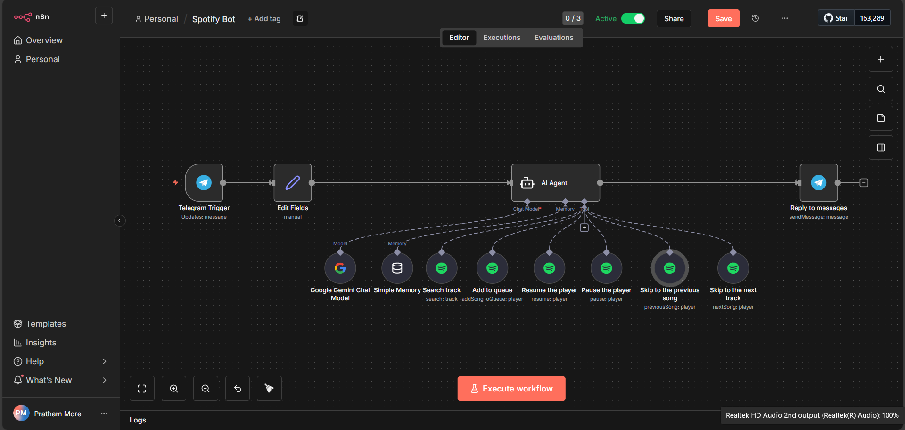

# 🎧 Telegram Spotify AI Agent (n8n – No Code)

A **no-code AI agent** built using **n8n**, **Telegram**, **Google Gemini**, and **Spotify API** that understands natural language commands and controls Spotify playback.

---

## 🚀 Features

* 🎵 Play any song by name
* ➕ Add songs to Spotify queue
* ⏸ Pause / Resume playback
* ⏭ Skip to next / previous track
* 🤖 AI-powered intent detection using Google Gemini
* 🧩 100% drag-and-drop (no Code node)

---

## 🛠 Tech Stack

* **n8n** (workflow automation)
* **Telegram Bot API**
* **Google Gemini 1.5**
* **Spotify Web API**

---

## 📸 Demo




---

## ⚙️ Setup Instructions

### 1. Clone Repository

```bash
git clone https://github.com/YOUR_USERNAME/telegram-spotify-n8n-ai-agent.git
```

### 2. Import Workflow into n8n

* Open n8n
* Click **Import**
* Upload `workflow/telegram-spotify-ai-agent.json`

### 3. Add Credentials (Required)

* Telegram Bot Token
* Spotify OAuth (Premium required)
* Google Gemini API Key

⚠️ Credentials are **NOT included** for security reasons.

---

## 💬 Example Commands

```
Play Believer
Add Shape of You to queue
Pause music
Next song
```

---

## 🧠 How It Works

1. Telegram Trigger receives message
2. Google Gemini converts text → structured intent
3. Switch node routes action
4. Spotify node controls playback
5. Telegram sends confirmation

---

## 🎯 Use Cases

* AI automation portfolio project
* No-code AI agent demo
* Personal music assistant
* Telegram bot showcase

---

## 📌 Notes

* Spotify Premium account required
* Spotify must be open on at least one device
* Designed for **local or cloud n8n**

---

## 🧑‍💻 Author

**Your Name**
No-Code Automation Developer (n8n)

---
